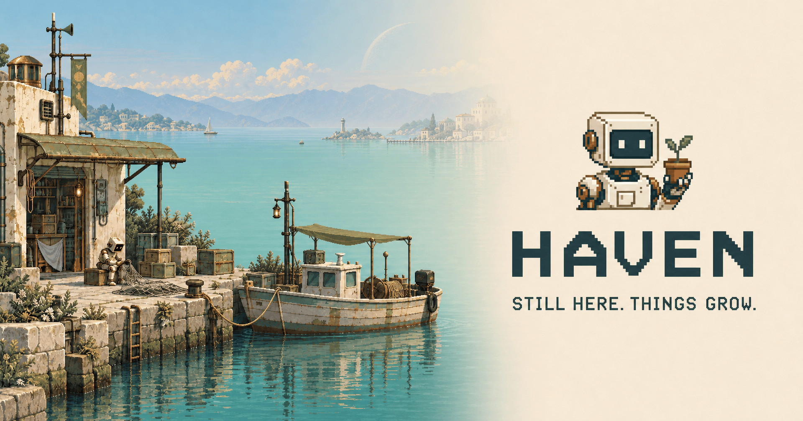

# Simone Merli

### Ruby on Rails developer · Musician

I write software and make music. Here are some of my projects.

## Featured projects

<h3><a href="https://github.com/simoz/omarchy-outpost-theme">omarchy-outpost-theme</a></h3>

Pixel art, wild landscapes and remote outposts inhabited by robots.

<table>
<tr>
<td width="50%" valign="top">

<h3><a href="https://github.com/simoz/fretlab">fretlab</a></h3>

Scales, triads, chords and tunings: a music playground in your browser.

</td>
<td width="50%" valign="top">

<h3><a href="https://github.com/simoz/omarchy-vessel">omarchy-vessel</a></h3>

A marine radar that puts a name to the boats on your horizon.

</td>
</tr>
<tr>
<td width="50%" valign="top">

<h3><a href="https://github.com/simoz/omarchy-haven-theme">omarchy-haven-theme</a></h3>

Quiet harbours, rooftop gardens and little robots.

</td>
<td width="50%" valign="top">

<h3><a href="https://github.com/simoz/omarchy-turner-theme">omarchy-turner-theme</a></h3>

An Omarchy theme inspired by William Turner.

</td>
</tr>
</table>
